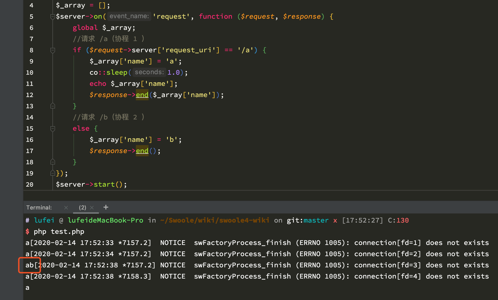

# 协程编程须知

使用 Swoole [协程](/coroutine) 特性，请认真阅读本章节编程须知。

## 编程范式

* 协程内部禁止使用全局变量
* 协程使用`use`关键字引入外部变量到当前作用域禁止使用引用
* 协程之间通讯必须使用[Channel](/coroutine/channel)

!> 即协程之间通讯不要使用全局变量或者引用外部变量到当前作用域，而要使用`Channel`

* 项目中如果有扩展`hook`了`zend_execute_ex`或者`zend_execute_internal`，需要特别注意一下C栈。可以使用[Co::set](/coroutine/coroutine?id=set)重新设置C栈大小

!> `hook`这两个入口函数后，大部分情况下会把平坦的PHP指令调用变为`C`函数调用，增加C栈的消耗。

## 退出协程

在Swoole低版本中，协程中使用`exit`强行退出脚本会导致内存错误导致不可预期的结果或`coredump`，在Swoole服务中使用`exit`会使整个服务进程退出且内部的协程全部异常终止导致严重问题，Swoole长期以来一直禁止开发者使用`exit`，但开发者可以使用抛出异常这种非常规的方式，在顶层`catch`来实现和`exit`相同的退出逻辑

!> v4.2.2版本及以上允许脚本(未创建`http_server`)在只有当前协程的情况下`exit`退出

Swoole **v4.1.0** 版本及以上直接支持了在`协程`、`服务事件循环`中使用PHP的`exit`，此时底层会自动抛出一个可捕获的`Swoole\ExitException`，开发者可以在需要的位置捕获并实现与原生PHP一样的退出逻辑。

### Swoole\ExitException

`Swoole\ExitException`继承于`Exception`且新增了两个方法`getStatus`和`getFlags`:

```php
namespace Swoole;

class ExitException extends \Exception
{
	public function getStatus(): mixed
	public function getFlags(): int
}
```

#### getStatus()

获取exit($status)退出时的传入的`status`参数，支持任意的变量类型。

```php
public function getStatus(): mixed
```

#### getFlags()

获取exit退出时所处的环境信息掩码。

```php
public function getFlags(): int
```

目前有以下掩码：

| 常量 | 说明 |
| -- | -- |
| SWOOLE_EXIT_IN_COROUTINE | 协程中退出 |
| SWOOLE_EXIT_IN_SERVER | Server中退出 |

### 使用方法

#### 基本使用

```php
use Swoole\Coroutine;
use function Swoole\Coroutine\run;

function route()
{
    controller();
}

function controller()
{
    your_code();
}

function your_code()
{
    Coroutine::sleep(.001);
    exit(1);
}

run(function () {
    try {
        route();
    } catch (\Swoole\ExitException $e) {
        var_dump($e->getMessage());
        var_dump($e->getStatus() === 1);
        var_dump($e->getFlags() === SWOOLE_EXIT_IN_COROUTINE);
    }
});
```

#### 带状态码的退出

```php
use function Swoole\Coroutine\run;

$exit_status = 0;
run(function () {
    try {
        exit(123);
    } catch (\Swoole\ExitException $e) {
        global $exit_status;
        $exit_status = $e->getStatus();
    }
});
var_dump($exit_status);
```

## 异常处理

在协程编程中可直接使用`try/catch`处理异常。**但必须在协程内捕获，不得跨协程捕获异常**。

!> 不仅是应用层`throw`的`Exception`，底层的一些错误也是可以被捕获的，如`function`、`class`、`method`不存在

### 错误示例

下面的代码中，`try/catch`和`throw`在不同的协程中，协程内无法捕获到此异常。当协程退出时，发现有未捕获的异常，将引起致命错误。

```bash
PHP Fatal error:  Uncaught RuntimeException
```

```php
try {
	Swoole\Coroutine::create(function () {
		throw new \RuntimeException(__FILE__, __LINE__);
	});
}
catch (\Throwable $e) {
	echo $e;
}
```

### 正确示例

在协程内捕获异常。

```php
function test() {
	throw new \RuntimeException(__FILE__, __LINE__);
}

Swoole\Coroutine::create(function () {
	try {
		test();
	}
	catch (\Throwable $e) {
		echo $e;
	}
});
```

## 在 __get / __set 魔术方法里不得产生协程切换

原因：[参考PHP7内核剖析](https://github.com/pangudashu/php7-internal/blob/40645cfe087b373c80738881911ae3b178818f11/3/zend_object.md)

> **Note:** 如果类存在__get()方法，则在实例化对象分配属性内存(即:properties_table)时会多分配一个zval，类型为HashTable，每次调用__get($var)时会把输入的$var名称存入这个哈希表，这样做的目的是防止循环调用，举个例子：
> 
> ***public function __get($var) { return $this->$var; }***
>
> 这种情况是调用__get()时又访问了一个不存在的属性，也就是会在__get()方法中递归调用，如果不对请求的$var作判断则将一直递归下去，所以在调用__get()前首先会判断当前$var是不是已经在__get()中了，如果是则不会再调用__get()，否则会把$var作为key插入那个HashTable，然后将哈希值设置为：*guard |= IN_ISSET，调用完__get()再把哈希值设置为：*guard &= ~IN_ISSET。
>
> 这个HashTable不仅仅是给__get()用的，其它魔术方法也会用到，所以其哈希值类型是zend_long，不同的魔术方法占不同的bit位；其次，并不是所有的对象都会额外分配这个HashTable，在对象创建时会根据 ***zend_class_entry.ce_flags*** 是否包含 ***ZEND_ACC_USE_GUARDS*** 确定是否分配，在类编译时如果发现定义了__get()、__set()、__unset()、__isset()方法则会将ce_flags打上这个掩码。

协程切换出去后，下次调用将会被判断为循环调用，此问题为PHP**特性**所致，与PHP开发组沟通后仍暂时无解。

建议：自己实现`get`/`set`方法显式调用

原始问题链接：[#2625](https://github.com/swoole/swoole-src/issues/2625)

## 严重错误

以下行为会导致出现严重错误。

### 在多个协程间共用一个连接

与同步阻塞程序不同，协程是并发处理请求的，因此同一时间可能会有很多个请求在并行处理，一旦共用客户端连接，就会导致不同协程之间发生数据错乱。参考：[多协程共享TCP连接](/question/use?id=client-has-already-been-bound-to-another-coroutine)

### 使用类静态变量/全局变量保存上下文

多个协程是并发执行的，因此不能使用类静态变量/全局变量保存协程上下文内容。使用局部变量是安全的，因为局部变量的值会自动保存在协程栈中，其他协程访问不到协程的局部变量。

#### 错误示例

```php
$server = new Swoole\Http\Server('127.0.0.1', 9501);

$_array = [];
$server->on('request', function ($request, $response) {
    global $_array;
    //请求 /a（协程 1 ）
    if ($request->server['request_uri'] == '/a') {
        $_array['name'] = 'a';
        co::sleep(1.0);
        echo $_array['name'];
        $response->end($_array['name']);
    }
    //请求 /b（协程 2 ）
    else {
        $_array['name'] = 'b';
        $response->end();
    }
});
$server->start();
```

发起`2`个并发请求。

```shell
curl http://127.0.0.1:9501/a
curl http://127.0.0.1:9501/b
```

* 协程`1`中设置了全局变量`$_array['name']`的值为`a`
* 协程`1`调用`co::sleep`挂起
* 协程`2`执行，将`$_array['name']`的值为`b`，协程2结束
* 这时定时器返回，底层恢复协程1的运行。而协程1的逻辑中有一个上下文的依赖关系。当再次打印`$_array['name']`的值时，程序预期是`a`，但这个值已经被协程`2`所修改，实际结果却是`b`，这样就造成了逻辑错误
* 同理，使用类静态变量`Class::$array`、全局对象属性`$object->array`、其他超全局变量`$GLOBALS`等，进行上下文保存在协程程序中是非常危险的。可能会出现不符合预期的行为。



#### 正确示例：使用Context管理上下文

可以使用一个`Context`类来管理协程上下文，在`Context`类中，使用`Coroutine::getuid`获取了协程`ID`，然后隔离不同协程之间的全局变量，协程退出时清理上下文数据

```php
use Swoole\Coroutine;

class Context
{
    protected static $pool = [];

    static function get($key)
    {
        $cid = Coroutine::getuid();
        if ($cid < 0)
        {
            return null;
        }
        if(isset(self::$pool[$cid][$key])){
            return self::$pool[$cid][$key];
        }
        return null;
    }

    static function put($key, $item)
    {
        $cid = Coroutine::getuid();
        if ($cid > 0)
        {
            self::$pool[$cid][$key] = $item;
        }

    }

    static function delete($key = null)
    {
        $cid = Coroutine::getuid();
        if ($cid > 0)
        {
            if($key){
                unset(self::$pool[$cid][$key]);
            }else{
                unset(self::$pool[$cid]);
            }
        }
    }
}
```

使用：

```php
use Swoole\Coroutine\Context;

$server = new Swoole\Http\Server('127.0.0.1', 9501);

$server->on('request', function ($request, $response) {
    if ($request->server['request_uri'] == '/a') {
        Context::put('name', 'a');
        co::sleep(1.0);
        echo Context::get('name');
        $response->end(Context::get('name'));
        //退出协程时清理
        Context::delete('name');
    } else {
        Context::put('name', 'b');
        $response->end();
        //退出协程时清理
        Context::delete();
    }
});
$server->start();
```