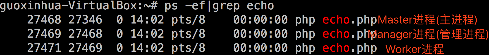

# 基础知识

## 四种设置回调函数的方式

* **匿名函数**

```php
$server->on('Request', function ($req, $resp) use ($a, $b, $c) {
    echo "hello world";
});
```
!> 可使用`use`向匿名函数传递参数

* **类静态方法**

```php
class A
{
    static function test($req, $resp)
    {
        echo "hello world";
    }
}
$server->on('Request', 'A::Test');
$server->on('Request', array('A', 'Test'));
```
!> 对应的静态方法必须为`public`

* **函数**

```php
function my_onRequest($req, $resp)
{
    echo "hello world";
}
$server->on('Request', 'my_onRequest');
```

* **对象方法**

```php
class A
{
    function test($req, $resp)
    {
        echo "hello world";
    }
}

$object = new A();
$server->on('Request', array($object, 'test'));
```

!> 对应的方法必须为`public`

## 同步IO/异步IO

在`Swoole4+`下所有的业务代码都是同步写法（`Swoole1.x`时代才支持异步写法，现在已经移除了异步客户端，对应的需求完全可以用协程客户端实现），完全没有心智负担，符合人类思维习惯，但同步的写法底层可能有`同步IO/异步IO`之分。

无论是同步IO/异步IO，`Swoole/Server`都可以维持大量`TCP`客户端连接(参考[SWOOLE_PROCESS模式](/learn?id=swoole_process))。你的服务是阻塞还是非阻塞不需要单独的配置某些参数，取决于你的代码里面是否有同步IO的操作。

**什么是同步IO：**
 
简单的例子就是执行到`MySQL->query`的时候，这个进程什么事情都不做，等待MySQL返回结果，返回结果后再向下执行代码，所以同步IO的服务并发能力是很差的。

**什么样的代码是同步IO：**

 * 没有开启[一键协程化](/runtime)的时候，那么你的代码里面绝大部分涉及IO的操作都是同步IO的，协程化后，就会变成异步IO，进程不会傻等在那里，参考[协程调度](/coroutine?id=协程调度)。
 * 有些`IO`是没法一键协程化，没法将同步IO变为异步IO的，例如`MongoDB`(相信`Swoole`会解决这个问题)，需要写代码时候注意。

!> [协程](/coroutine) 是为了提高并发的，如果我的应用就没有高并发，或者必须要用某些无法异步化IO的操作(例如上文的MongoDB)，那么你完全可以不开启[一键协程化](/runtime)，关闭[enable_coroutine](/server/setting?id=enable_coroutine)，多开一些`Worker`进程，这就是和`Fpm/Apache`是一样的模型了，值得一提的是由于`Swoole`是 [常驻进程](https://course.swoole-cloud.com/course-video/80) 的，即使同步IO性能也会有很大提升，实际应用中也有很多公司这样做。

### 同步IO转换成异步IO

[上小节](/learn?id=同步io异步io)介绍了什么是同步/异步IO，在`Swoole`下面，有些情况同步的`IO`操作是可以转换成异步IO的。
 
 - 开启[一键协程化](/runtime)后，`MySQL`、`Redis`、`Curl`等操作会变成异步IO。
 - 利用[Event](/event)模块手动管理事件，将fd加到[EventLoop](/learn?id=什么是eventloop)里面，变成异步IO，例子：

```php
//利用inotify监控文件变化
$fd = inotify_init();
//将$fd添加到Swoole的EventLoop
Swoole\Event::add($fd, function () use ($fd){
    $var = inotify_read($fd);//文件发生变化后读取变化的文件。
    var_dump($var);
});
```

上述代码如果不调用`Swoole\Event::add`将IO异步化，直接`inotify_read()`将阻塞Worker进程，其他的请求将得不到处理。

 - 使用`Swoole\Server`的[sendMessage()](/server/methods?id=sendMessage)方法进行进程间通讯，默认`sendMessage`是同步IO，但有些情况是会被`Swoole`转换成异步IO，用[User进程](/server/methods?id=addprocess)举例：

```php
$serv = new Swoole\Server("0.0.0.0", 9501, SWOOLE_BASE);
$serv->set(
    [
        'worker_num' => 1,
    ]
);

$serv->on('pipeMessage', function ($serv, $src_worker_id, $data) {
    echo "#{$serv->worker_id} message from #$src_worker_id: $data\n";
    sleep(10);//不接收sendMessage发来的数据，缓冲区将很快写满
});

$serv->on('receive', function (swoole_server $serv, $fd, $reactor_id, $data) {

});

//情况1：同步IO(默认行为)
$userProcess = new Swoole\Process(function ($worker) use ($serv) {
    while (1) {
        var_dump($serv->sendMessage("big string", 0));//默认情况下，缓存区写满后，此处会阻塞
    }
}, false);

//情况2：通过enable_coroutine参数开启UserProcess进程的协程支持，为了防止其他协程得不到 EventLoop 的调度，
//Swoole会把sendMessage转换成异步IO
$enable_coroutine = true;
$userProcess = new Swoole\Process(function ($worker) use ($serv) {
    while (1) {
        var_dump($serv->sendMessage("big string", 0));//缓存区写满后，不会阻塞进程,会报错
    }
}, false, 1, $enable_coroutine);

//情况3：在UserProcess进程里面如果设置了异步回调(例如设置定时器、Swoole\Event::add等)，
//为了防止其他回调函数得不到 EventLoop 的调度，Swoole会把sendMessage转换成异步IO
$userProcess = new Swoole\Process(function ($worker) use ($serv) {
    swoole_timer_tick(2000, function ($interval) use ($worker, $serv) {
        echo "timer\n";
    });
    while (1) {
        var_dump($serv->sendMessage("big string", 0));//缓存区写满后，不会阻塞进程,会报错
    }
}, false);

$serv->addProcess($userProcess);

$serv->start();
```

 - 同理，[Task进程](/learn?id=taskworker进程)通过`sendMessage()`进程间通讯是一样的，不同的是task进程开启协程支持是通过Server的[task_enable_coroutine](/server/setting?id=task_enable_coroutine)配置开启，并且不存在`情况3`，也就是说task进程不会因为开启异步回调就将sendMessage异步IO。

## 什么是EventLoop

所谓`EventLoop`，即事件循环，可以简单的理解为epoll_wait，会把所有要发生事件的句柄（fd）加入到`epoll_wait`中，这些事件包括可读，可写，出错等。

对应的进程就阻塞在`epoll_wait`这个内核函数上，当发生了事件(或超时)后`epoll_wait`这个函数就会结束阻塞返回结果，就可以回调相应的PHP函数，例如，收到客户端发来的数据，回调`onReceive`回调函数。

当有大量的fd放入到了`epoll_wait`中，并且同时产生了大量的事件，`epoll_wait`函数返回的时候就会挨个调用相应的回调函数，叫做一轮事件循环，即IO多路复用，然后再次阻塞调用`epoll_wait`进行下一轮事件循环。

## TCP数据包边界问题

在没有并发的情况下[快速启动中的代码](/start/start_tcp_server)可以正常运行，但是并发高了就会有TCP数据包边界问题，`TCP`协议在底层机制上解决了`UDP`协议的顺序和丢包重传问题，但相比`UDP`又带来了新的问题，`TCP`协议是流式的，数据包没有边界，应用程序使用`TCP`通信就会面临这些难题，俗称TCP粘包问题。

因为`TCP`通信是流式的，在接收`1`个大数据包时，可能会被拆分成多个数据包发送。多次`Send`底层也可能会合并成一次进行发送。这里就需要2个操作来解决：

* 分包：`Server`收到了多个数据包，需要拆分数据包
* 合包：`Server`收到的数据只是包的一部分，需要缓存数据，合并成完整的包

所以TCP网络通信时需要设定通信协议。常见的TCP通用网络通信协议有`HTTP`、`HTTPS`、`FTP`、`SMTP`、`POP3`、`IMAP`、`SSH`、`Redis`、`Memcache`、`MySQL` 。

值得一提的是，Swoole内置了很多常见通用协议的解析，来解决这些协议的服务器的TCP数据包边界问题，只需要简单的配置即可，参考[open_http_protocol](/server/setting?id=open_http_protocol)/[open_http2_protocol](/http_server?id=open_http2_protocol)/[open_websocket_protocol](/server/setting?id=open_websocket_protocol)/[open_mqtt_protocol](/server/setting?id=open_mqtt_protocol)

除了通用协议外还可以自定义协议，`Swoole`支持了`2`种类型的自定义网络通信协议。

* **EOF结束符协议**

`EOF`协议处理的原理是每个数据包结尾加一串特殊字符表示包已结束。如`Memcache`、`FTP`、`SMTP`都使用`\r\n`作为结束符。发送数据时只需要在包末尾增加`\r\n`即可。使用`EOF`协议处理，一定要确保数据包中间不会出现`EOF`，否则会造成分包错误。

在`Server`和`Client`的代码中只需要设置`2`个参数就可以使用`EOF`协议处理。

```php
$server->set(array(
    'open_eof_split' => true,
    'package_eof' => "\r\n",
));
$client->set(array(
    'open_eof_split' => true,
    'package_eof' => "\r\n",
));
```

但上述`EOF`的配置性能会比较差，Swoole会遍历每个字节，查看数据是否是`\r\n`，除了上述方式还可以这样设置。

```php
$server->set(array(
    'open_eof_check' => true,
    'package_eof' => "\r\n",
));
$client->set(array(
    'open_eof_check' => true,
    'package_eof' => "\r\n",
));
```
这组配置性能会好很多，不用遍历数据，但是只能解决`分包`问题，没法解决`合包`问题，也就是说可能`onReceive`一下收到客户端发来的好几个请求，需要自行分包，例如`explode("\r\n", $data)`，这组配置的最大用途是，如果请求应答式的服务(例如终端敲命令)，无需考虑拆分数据的问题。原因是客户端在发起一次请求后，必须等到服务器端返回当前请求的响应数据，才会发起第二次请求，不会同时发送`2`个请求。

* **固定包头+包体协议**

固定包头的方法非常通用，在服务器端程序中经常能看到。这种协议的特点是一个数据包总是由包头+包体`2`部分组成。包头由一个字段指定了包体或整个包的长度，长度一般是使用`2`字节/`4`字节整数来表示。服务器收到包头后，可以根据长度值来精确控制需要再接收多少数据就是完整的数据包。`Swoole`的配置可以很好的支持这种协议，可以灵活地设置`4`项参数应对所有情况。

`Server`在[onReceive](/server/events?id=onreceive)回调函数中处理数据包，当设置了协议处理后，只有收到一个完整数据包时才会触发[onReceive](/server/events?id=onreceive)事件。客户端在设置了协议处理后，调用 [$client->recv()](/client?id=recv) 不再需要传入长度，`recv`函数在收到完整数据包或发生错误后返回。

```php
$server->set(array(
    'open_length_check' => true,
    'package_max_length' => 81920,
    'package_length_type' => 'n', //see php pack()
    'package_length_offset' => 0,
    'package_body_offset' => 2,
));
```

!> 具体每个配置的含义参见`服务端/客户端`章节的[配置](/server/setting?id=open_length_check)小节

## 什么是IPC

同一台主机上两个进程间通信(简称IPC)的方式有很多种，在Swoole下使用了2种方式`Unix Socket`和`sysvmsg`，下面分别介绍：

- **Unix Socket**  

    全名 UNIX Domain Socket, 简称`UDS`, 使用套接字的API(socket，bind，listen，connect，read，write，close等)，和TCP/IP不同的是不需要指定ip和port，而是通过一个文件名来表示(例如FPM和Nginx之间的`/tmp/php-fcgi.sock`)，UDS是Linux内核实现的全内存通信，无任何`IO`消耗。在`1`进程`write`，`1`进程`read`，每次读写`1024`字节数据的测试中，`100`万次通信仅需`1.02`秒，而且功能非常的强大，`Swoole`下默认用的就是这种IPC方式。  
      
    * **`SOCK_STREAM` 和 `SOCK_DGRAM`**  

        - `Swoole`下面使用`UDS`通讯有两种类型，`SOCK_STREAM` 和 `SOCK_DGRAM`，可以简单的理解为TCP和UDP的区别，当使用`SOCK_STREAM`类型的时候同样需要考虑[TCP数据包边界问题](/learn?id=tcp数据包边界问题)。   
        - 当使用`SOCK_DGRAM`类型的时候不需要考虑TCP数据包边界问题，每个`send()`的数据都是有边界的，发送多大的数据接收的时候就收到多大的数据，没有传输过程中的丢包、乱序问题，`send`写入和`recv`读取的顺序是完全一致的。`send`返回成功后一定是可以`recv`到。 

    在IPC传输的数据比较小时非常适合用`SOCK_DGRAM`这种方式，**由于`IP`包每个最大有64k的限制，所以用`SOCK_DGRAM`进行IPC时候单次发送数据不能大于64k，同时要注意收包速度太慢操作系统缓冲区满了会丢弃包，因为UDP是允许丢包的，可以适当调大缓冲区**。

- **sysvmsg**
     
    即Linux提供的`消息队列`，这种`IPC`方式通过一个文件名来作为`key`进行通讯，这种方式非常的不灵活，实际项目使用的并不多，不做过多介绍。

    * **此种IPC方式只有两个场景下有用:**

        - 防止丢数据，如果整个服务都挂掉，再次启动队列中的消息也在，可以继续消费，**但同样有脏数据的问题**。
        - 可以外部投递数据，比如Swoole下的`Worker进程`通过消息队列给`Task进程`投递任务，第三方的进程也可以投递任务到队列里面让Task消费，甚至可以在命令行手动添加消息到队列。

## Master进程、Reactor线程、Worker进程、Task进程、Manager进程的区别与联系 :id=diff-process

### Master进程

* Master进程是一个多线程进程，参考[进程/线程结构图](/server/init?id=进程线程结构图)

### Reactor线程

* Reactor线程是在Master进程中创建的线程
* 负责维护客户端`TCP`连接、处理网络`IO`、处理协议、收发数据
* 不执行任何PHP代码
* 将`TCP`客户端发来的数据缓冲、拼接、拆分成完整的一个请求数据包

### Worker进程

* 接受由`Reactor`线程投递的请求数据包，并执行`PHP`回调函数处理数据
* 生成响应数据并发给`Reactor`线程，由`Reactor`线程发送给`TCP`客户端
* 可以是异步非阻塞模式，也可以是同步阻塞模式
* `Worker`以多进程的方式运行

### TaskWorker进程

* 接受由`Worker`进程通过 Swoole\Server->[task](/server/methods?id=task)/[taskwait](/server/methods?id=taskwait)/[taskCo](/server/methods?id=taskCo)/[taskWaitMulti](/server/methods?id=taskWaitMulti) 方法投递的任务
* 处理任务，并将结果数据返回（使用 [Swoole\Server->finish](/server/methods?id=finish)）给`Worker`进程
* 完全是**同步阻塞**模式
* `TaskWorker`以多进程的方式运行，[task完整示例](/start/start_task)

### Manager进程

* 负责创建/回收`worker`/`task`进程

他们之间的关系可以理解为`Reactor`就是`nginx`，`Worker`就是`PHP-FPM`。`Reactor`线程异步并行地处理网络请求，然后再转发给`Worker`进程中去处理。`Reactor`和`Worker`间通过[unixSocket](/learn?id=什么是IPC)进行通信。

在`PHP-FPM`的应用中，经常会将一个任务异步投递到`Redis`等队列中，并在后台启动一些`PHP`进程异步地处理这些任务。`Swoole`提供的`TaskWorker`是一套更完整的方案，将任务的投递、队列、`PHP`任务处理进程管理合为一体。通过底层提供的`API`可以非常简单地实现异步任务的处理。另外`TaskWorker`还可以在任务执行完成后，再返回一个结果反馈到`Worker`。

`Swoole`的`Reactor`、`Worker`、`TaskWorker`之间可以紧密的结合起来，提供更高级的使用方式。

一个更通俗的比喻，假设`Server`就是一个工厂，那`Reactor`就是销售，接受客户订单。而`Worker`就是工人，当销售接到订单后，`Worker`去工作生产出客户要的东西。而`TaskWorker`可以理解为行政人员，可以帮助`Worker`干些杂事，让`Worker`专心工作。

如图：



## Server的两种运行模式介绍

在`Swoole\Server`构造函数的第三个参数，可以填2个常量值 -- [SWOOLE_BASE](/learn?id=swoole_base)或[SWOOLE_PROCESS](/learn?id=swoole_process)，下面将分别介绍这两个模式的区别以及优缺点

### SWOOLE_PROCESS

SWOOLE_PROCESS模式的`Server`所有客户端的TCP连接都是和[主进程](/learn?id=reactor线程)建立的，内部实现比较复杂，用了大量的进程间通信、进程管理机制。适合业务逻辑非常复杂的场景。`Swoole`提供了完善的进程管理、内存保护机制。
在业务逻辑非常复杂的情况下，也可以长期稳定运行。

`Swoole`在[Reactor](/learn?id=reactor线程)线程中提供了`Buffer`的功能，可以应对大量慢速连接和逐字节的恶意客户端。

#### 进程模式的优点：

* 连接与数据请求发送是分离的，不会因为某些连接数据量大某些连接数据量小导致`Worker`进程不均衡
* `Worker`进程发生致命错误时，连接并不会被切断
* 可实现单连接并发，仅保持少量`TCP`连接，请求可以并发地在多个`Worker`进程中处理

#### 进程模式的缺点：

* 存在`2`次`IPC`的开销，`master`进程与`worker`进程需要使用[unixSocket](/learn?id=什么是IPC)进行通信

### SWOOLE_BASE

SWOOLE_BASE这种模式就是传统的异步非阻塞`Server`。与`Nginx`和`Node.js`等程序是完全一致的。

[worker_num](/server/setting?id=worker_num)参数对于`BASE`模式仍然有效，会启动多个`Worker`进程。

当有TCP连接请求进来的时候，所有的Worker进程去争抢这一个连接，并最终会有一个worker进程成功直接和客户端建立TCP连接，之后这个连接的所有数据收发直接和这个worker通讯，不经过主进程的Reactor线程转发。

* `BASE`模式下没有`Master`进程的角色，只有[Manager](/learn?id=manager进程)进程的角色。
* 每个`Worker`进程同时承担了[SWOOLE_PROCESS](/learn?id=swoole_process)模式下[Reactor](/learn?id=reactor线程)线程和`Worker`进程两部分职责。
* `BASE`模式下`Manager`进程是可选的，当设置了`worker_num=1`，并且没有使用`Task`和`MaxRequest`特性时，底层将直接创建一个单独的`Worker`进程，不创建`Manager`进程

#### BASE模式的优点：

* `BASE`模式没有`IPC`开销，性能更好
* `BASE`模式代码更简单，不容易出错

#### BASE模式的缺点：

* `TCP`连接是在`Worker`进程中维持的，所以当某个`Worker`进程挂掉时，此`Worker`内的所有连接都将被关闭
* 少量`TCP`长连接无法利用到所有`Worker`进程
* `TCP`连接与`Worker`是绑定的，长连接应用中某些连接的数据量大，这些连接所在的`Worker`进程负载会非常高。但某些连接数据量小，所以在`Worker`进程的负载会非常低，不同的`Worker`进程无法实现均衡。
*  如果回调函数中有阻塞操作会导致`Server`退化为同步模式，此时容易导致TCP的[backlog](/server/setting?id=backlog)队列塞满问题。

#### BASE模式的适用场景：

如果客户端连接之间不需要交互，可以使用`BASE`模式。如`Memcache`、`HTTP`服务器等。

#### BASE模式的限制：

在 `BASE` 模式下，[Server 方法](/server/methods)除了 [send](/server/methods?id=send) 和 [close](/server/methods?id=close)以外，其他的方法都**不支持**跨进程执行。

!> v4.5.x 版本的 `BASE` 模式下仅`send`方法支持跨进程执行；v4.6.x 版本中只有`send`和`close`方法支持。

## Process、Process\Pool、UserProcess的区别是什么 :id=process-diff

### Process

[Process](/process/process)是 Swoole 提供的进程管理模块，用来替代 PHP 的 `pcntl`。
 
* 可以方便的实现进程间通讯；
* 支持重定向标准输入和输出，在子进程内`echo`不会打印屏幕，而是写入管道，读键盘输入可以重定向为管道读取数据；
* 提供了[exec](/process/process?id=exec)接口，创建的进程可以执行其他程序，与原`PHP`父进程之间可以方便的通信；

!> 在协程环境中无法使用`Process`模块，可以使用`runtime hook`+`proc_open`实现，参考[协程进程管理](/coroutine/proc_open)

### Process\Pool

[Process\Pool](/process/process_pool)是将Server的进程管理模块封装成了PHP类，支持在PHP代码中使用Swoole的进程管理器。

在实际项目中经常需要写一些长期运行的脚本，如基于`Redis`、`Kafka`、`RabbitMQ`实现的多进程队列消费者，多进程爬虫等等，开发者需要使用`pcntl`和`posix`相关的扩展库实现多进程编程，但也需要开发者具备深厚的`Linux`系统编程功底，否则很容易出现问题，使用Swoole提供的进程管理器可大大简化多进程脚本编程工作。

* 保证工作进程的稳定性；
* 支持信号处理；
* 支持消息队列和`TCP-Socket`消息投递功能；

### UserProcess

`UserProcess`是使用[addProcess](/server/methods?id=addprocess)添加的一个用户自定义的工作进程，通常用于创建一个特殊的工作进程，用于监控、上报或者其他特殊的任务。

`UserProcess`虽然会托管到 [Manager进程](/learn?id=manager进程)，但是和 [Worker进程](/learn?id=worker进程) 相比是较为独立的进程，用于执行自定义功能。
