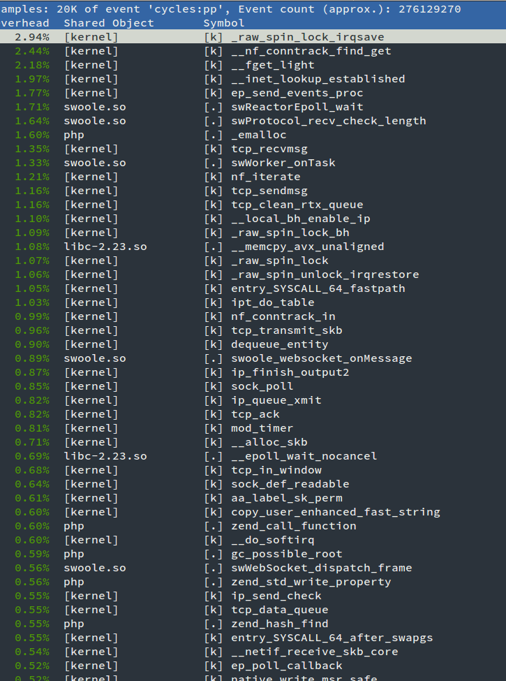

# 工具使用

## yasd

[yasd](https://github.com/swoole/yasd)

单步调试工具，可用于`Swoole`协程环境，支持`IDE`以及命令行的调试模式。

## tcpdump

在调试网络通信程序是tcpdump是必备工具。tcpdump很强大，可以看到网络通信的每个细节。如TCP，可以看到3次握手，PUSH/ACK数据推送，close4次挥手，全部细节。包括每一次网络收包的字节数，时间等。

### 使用方法

最简单的一个使用示例：

```shell
sudo tcpdump -i any tcp port 9501
```
* -i 参数指定了网卡，any表示所有网卡
* tcp 指定仅监听TCP协议
* port 指定监听的端口

!> tcpdump需要root权限；需要要看通信的数据内容，可以加`-Xnlps0`参数，其他更多参数请参见网上的文章

### 运行结果

```
13:29:07.788802 IP localhost.42333 > localhost.9501: Flags [S], seq 828582357, win 43690, options [mss 65495,sackOK,TS val 2207513 ecr 0,nop,wscale 7], length 0
13:29:07.788815 IP localhost.9501 > localhost.42333: Flags [S.], seq 1242884615, ack 828582358, win 43690, options [mss 65495,sackOK,TS val 2207513 ecr 2207513,nop,wscale 7], length 0
13:29:07.788830 IP localhost.42333 > localhost.9501: Flags [.], ack 1, win 342, options [nop,nop,TS val 2207513 ecr 2207513], length 0
13:29:10.298686 IP localhost.42333 > localhost.9501: Flags [P.], seq 1:5, ack 1, win 342, options [nop,nop,TS val 2208141 ecr 2207513], length 4
13:29:10.298708 IP localhost.9501 > localhost.42333: Flags [.], ack 5, win 342, options [nop,nop,TS val 2208141 ecr 2208141], length 0
13:29:10.298795 IP localhost.9501 > localhost.42333: Flags [P.], seq 1:13, ack 5, win 342, options [nop,nop,TS val 2208141 ecr 2208141], length 12
13:29:10.298803 IP localhost.42333 > localhost.9501: Flags [.], ack 13, win 342, options [nop,nop,TS val 2208141 ecr 2208141], length 0
13:29:11.563361 IP localhost.42333 > localhost.9501: Flags [F.], seq 5, ack 13, win 342, options [nop,nop,TS val 2208457 ecr 2208141], length 0
13:29:11.563450 IP localhost.9501 > localhost.42333: Flags [F.], seq 13, ack 6, win 342, options [nop,nop,TS val 2208457 ecr 2208457], length 0
13:29:11.563473 IP localhost.42333 > localhost.9501: Flags [.], ack 14, win 342, options [nop,nop,TS val 2208457 ecr 2208457], length 0
```
* `13:29:11.563473` 时间带有精确到微妙
*  localhost.42333 > localhost.9501 表示通信的流向，42333是客户端，9501是服务器端
* [S] 表示这是一个SYN请求
* [.] 表示这是一个ACK确认包，(client)SYN->(server)SYN->(client)ACK 就是3次握手过程
* [P] 表示这个是一个数据推送，可以是从服务器端向客户端推送，也可以从客户端向服务器端推
* [F] 表示这是一个FIN包，是关闭连接操作，client/server都有可能发起
* [R] 表示这是一个RST包，与F包作用相同，但RST表示连接关闭时，仍然有数据未被处理。可以理解为是强制切断连接
* win 342是指滑动窗口大小
* length 12指数据包的大小

## strace

strace可以跟踪系统调用的执行情况，在程序发生问题后，可以用strace分析和跟踪问题。

!> FreeBSD/MacOS下可以使用truss

### 使用方法

```shell
strace -o /tmp/strace.log -f -p $PID
```

* -f 表示跟踪多线程和多进程，如果不加-f参数，无法抓取到子进程和子线程的运行情况
* -o 表示将结果输出到一个文件中
* -p $PID，指定跟踪的进程ID，通过ps aux可以看到
* -tt 打印系统调用发生的时间，精确到微妙
* -s 限定字符串打印的长度，如recvfrom系统调用收到的数据，默认只打印32字节
* -c 实时统计每个系统调用的耗时
* -T 打印每个系统调用的耗时

## gdb

GDB是GNU开源组织发布的一个强大的UNIX下的程序调试工具，可以用来调试C/C++开发的程序，PHP和Swoole是使用C语言开发的，所以可以用GDB来调试PHP+Swoole的程序。

gdb调试是命令行交互式的，需要掌握常用的指令。

### 使用方法

```shell
gdb -p 进程ID
gdb php
gdb php core
```

gdb有3种使用方式：

* 跟踪正在运行的PHP程序，使用gdb -p 进程ID
* 使用gdb运行并调试PHP程序，使用gdb php -> run server.php 进行调试
* PHP程序发生coredump后使用gdb加载core内存镜像进行调试 gdb php core

!> 如果PATH环境变量中没有php，gdb时需要指定绝对路径，如gdb /usr/local/bin/php

### 常用指令

* `p`：print，打印C变量的值
* `c`：continue，继续运行被中止的程序
* `b`：breakpoint，设置断点，可以按照函数名设置，如`b zif_php_function`，也可以按照源代码的行数指定断点，如`b src/networker/Server.c:1000`
* `t`：thread，切换线程，如果进程拥有多个线程，可以使用t指令，切换到不同的线程
* `ctrl + c`：中断当前正在运行的程序，和c指令配合使用
* `n`：next，执行下一行，单步调试
* `info threads`：查看运行的所有线程
* `l`：list，查看源码，可以使用`l 函数名` 或者 `l 行号`
* `bt`：backtrace，查看运行时的函数调用栈
* `finish`：完成当前函数
* `f`：frame，与bt配合使用，可以切换到函数调用栈的某一层
* `r`：run，运行程序

### zbacktrace

zbacktrace是PHP源码包提供的一个gdb自定义指令，功能与bt指令类似，与bt不同的是zbacktrace看到的调用栈是PHP函数调用栈，而不是C函数。

下载php-src，解压后从根目录中找到一个`.gdbinit`文件，在gdb shell中输入

```shell
source .gdbinit
zbacktrace
```
`.gdbinit`还提供了其他更多指令，可以查看源码了解详细的信息。

#### 使用gdb+zbacktrace跟踪死循环问题

```shell
gdb -p 进程ID
```

* 使用`ps aux`工具找出发生死循环的Worker进程ID
* `gdb -p`跟踪指定的进程
* 反复调用 `ctrl + c` 、`zbacktrace`、`c` 查看程序在哪段PHP代码发生循环
* 找到对应的PHP代码进行解决

## lsof

Linux平台提供了`lsof`工具可以查看某个进程打开的文件句柄。可以用于跟踪swoole的工作进程所有打开的socket、file、资源。

### 使用方法

```shell
lsof -p [进程ID]
```

### 运行结果

```shell
lsof -p 26821
lsof: WARNING: can't stat() tracefs file system /sys/kernel/debug/tracing
      Output information may be incomplete.
COMMAND   PID USER   FD      TYPE             DEVICE SIZE/OFF    NODE NAME
php     26821  htf  cwd       DIR                8,4     4096 5375979 /home/htf/workspace/swoole/examples
php     26821  htf  rtd       DIR                8,4     4096       2 /
php     26821  htf  txt       REG                8,4 24192400 6160666 /opt/php/php-5.6/bin/php
php     26821  htf  DEL       REG                0,5          7204965 /dev/zero
php     26821  htf  DEL       REG                0,5          7204960 /dev/zero
php     26821  htf  DEL       REG                0,5          7204958 /dev/zero
php     26821  htf  DEL       REG                0,5          7204957 /dev/zero
php     26821  htf  DEL       REG                0,5          7204945 /dev/zero
php     26821  htf  mem       REG                8,4   761912 6160770 /opt/php/php-5.6/lib/php/extensions/debug-zts-20131226/gd.so
php     26821  htf  mem       REG                8,4  2769230 2757968 /usr/local/lib/libcrypto.so.1.1
php     26821  htf  mem       REG                8,4   162632 6322346 /lib/x86_64-linux-gnu/ld-2.23.so
php     26821  htf  DEL       REG                0,5          7204959 /dev/zero
php     26821  htf    0u      CHR             136,20      0t0      23 /dev/pts/20
php     26821  htf    1u      CHR             136,20      0t0      23 /dev/pts/20
php     26821  htf    2u      CHR             136,20      0t0      23 /dev/pts/20
php     26821  htf    3r      CHR                1,9      0t0      11 /dev/urandom
php     26821  htf    4u     IPv4            7204948      0t0     TCP *:9501 (LISTEN)
php     26821  htf    5u     IPv4            7204949      0t0     UDP *:9502 
php     26821  htf    6u     IPv6            7204950      0t0     TCP *:9503 (LISTEN)
php     26821  htf    7u     IPv6            7204951      0t0     UDP *:9504 
php     26821  htf    8u     IPv4            7204952      0t0     TCP localhost:8000 (LISTEN)
php     26821  htf    9u     unix 0x0000000000000000      0t0 7204953 type=DGRAM
php     26821  htf   10u     unix 0x0000000000000000      0t0 7204954 type=DGRAM
php     26821  htf   11u     unix 0x0000000000000000      0t0 7204955 type=DGRAM
php     26821  htf   12u     unix 0x0000000000000000      0t0 7204956 type=DGRAM
php     26821  htf   13u  a_inode               0,11        0    9043 [eventfd]
php     26821  htf   14u     unix 0x0000000000000000      0t0 7204961 type=DGRAM
php     26821  htf   15u     unix 0x0000000000000000      0t0 7204962 type=DGRAM
php     26821  htf   16u     unix 0x0000000000000000      0t0 7204963 type=DGRAM
php     26821  htf   17u     unix 0x0000000000000000      0t0 7204964 type=DGRAM
php     26821  htf   18u  a_inode               0,11        0    9043 [eventpoll]
php     26821  htf   19u  a_inode               0,11        0    9043 [signalfd]
php     26821  htf   20u  a_inode               0,11        0    9043 [eventpoll]
php     26821  htf   22u     IPv4            7452776      0t0     TCP localhost:9501->localhost:59056 (ESTABLISHED)
```

* so文件是进程加载的动态连接库
* IPv4/IPv6 TCP (LISTEN) 是服务器监听的端口
* UDP 是服务器监听的UDP端口
* unix type=DGRAM 时是进程创建的[unixSocket](/learn?id=什么是IPC)
* IPv4 (ESTABLISHED) 表示连接到服务器的TCP客户端，包含了客户端的IP和PORT，以及状态(ESTABLISHED)
* 9u / 10u 表示该文件句柄的fd值(文件描述符)
* 其他更多信息可以参考lsof的手册

## perf

`perf`工具是Linux内核提供一个非常强大的动态跟踪工具，`perf top`指令可用于实时分析正在执行程序的性能问题。与`callgrind`、`xdebug`、`xhprof`等工具不同，`perf`无需修改代码导出profile结果文件。

### 使用方法

```shell
perf top -p [进程ID]
```

### 输出结果



perf结果中清楚地展示了当前进程运行时各个C函数的执行耗时，可以了解哪个C函数占用CPU资源较多。

如果你熟悉Zend VM，某些Zend函数调用过多，可以说明你的程序中大量使用了某些函数，导致CPU占用过高，针对性的进行优化。
