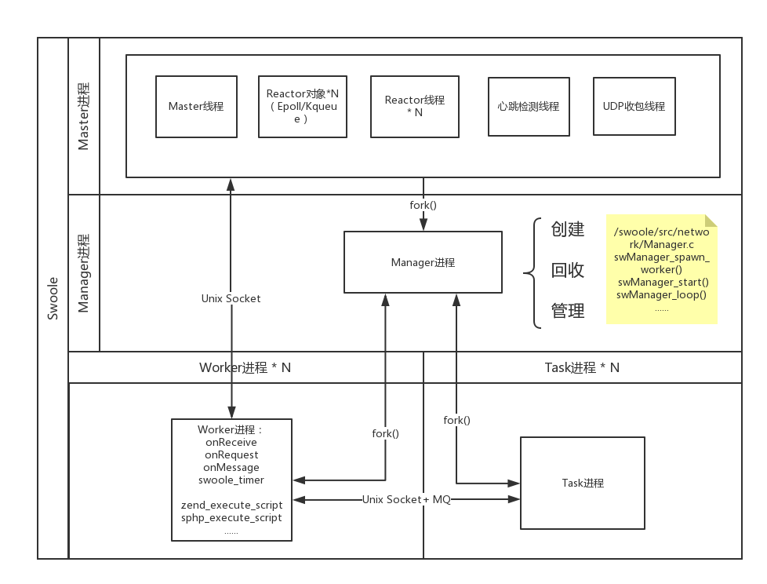

# 服务端(异步风格)

方便的创建一个异步服务器程序，支持`TCP`、`UDP`、[unixSocket](/learn?id=什么是IPC) 3 种socket类型，支持`IPv4`和`IPv6`，支持`SSL/TLS`单向双向证书的隧道加密。使用者无需关注底层实现细节，仅需要设置网络[事件](/server/events)的回调函数即可，示例参考[快速启动](/start/start_tcp_server)。

!> 只是`Server`端的风格是异步的(即所有事件都需要设置回调函数)，但同时也是支持协程的，开启了[enable_coroutine](/server/setting?id=enable_coroutine)之后就支持协程了(默认开启)，[协程](/coroutine)下所有的业务代码都是同步写法。

前往了解：

[Server 的两种运行模式介绍](/learn?id=server的两种运行模式介绍 ':target=_blank')  
[Process、ProcessPool、UserProcess的区别是什么](/learn?id=process-diff ':target=_blank')  
[Master进程、Reactor线程、Worker进程、Task进程、Manager进程的区别与联系](/learn?id=diff-process ':target=_blank')  

### 运行流程图 <!-- {docsify-ignore} --> 

### 进程/线程结构图 <!-- {docsify-ignore} --> 

